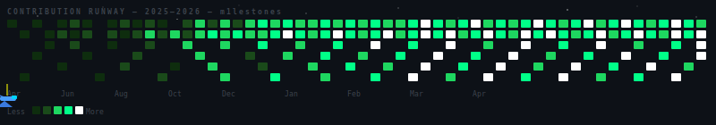
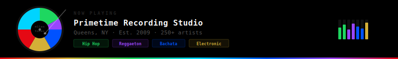

<div align="center">

[](https://git.io/typing-svg)

<br/>


[](https://www.linkedin.com/in/m1lestones/)
[](https://github.com/openai/openai-agents-python/pull/2851)
[](https://github.com/calcom/cal.com/pull/28776)
[](https://justiceforjoey.xyz)
[](https://github.com/m1lestones/theblueprintvault)

</div>

---

## 🎓 Juan Franco

<table>
<tr>
<td valign="top" width="65%">

```
╔══════════════════════════════════════════════════════════╗
║  J U A N   F R A N C O   ·   @ m 1 l e s t o n e s     ║
║  Queens, NY  ·  Dominican-American  ·  First-Gen         ║
╠══════════════════════════════════════════════════════════╣
║  15 yrs  →  Primetime Recording Studio (250+ artists)    ║
║  FAA     →  Airframe & Powerplant Certified              ║
║  Now     →  Pursuit Fellow  →  Full-Stack Engineer       ║
╠══════════════════════════════════════════════════════════╣
║  Built different.  Ship anyway.                          ║
╚══════════════════════════════════════════════════════════╝
```

</td>
<td valign="top" align="right">

```
  ███╗   ███╗ ██╗
  ████╗ ████║ ██║
  ██╔████╔██║ ██║
  ██║╚██╔╝██║ ╚═╝
  ██║ ╚═╝ ██║ ██╗
  ╚═╝     ╚═╝ ╚═╝
  m1lestones
```

</td>
</tr>
</table>

<div align="center">

| 🎙️ 15 Yrs Studio | ✅ OpenAI Merged | 🎤 250+ Artists | 👾 4 OS Repos | 💯 Lighthouse Score | 🌍 50K+ Orgs |
|:---:|:---:|:---:|:---:|:---:|:---:|
| Primetime Recording | openai-agents-python | Hip Hop · Reggaeton | Active Contributor | WCAG 2.1 AA | Cal.com Impact |

</div>

<br/>

Juan Franco is a **Software Engineering Fellow at Pursuit** and a builder with an unconventional path into tech. Growing up in **Queens as a first-generation Dominican American**, he built his career through music, aviation, and entrepreneurship before finding software engineering as the thread that connects everything he has ever done.

Fifteen years running **Primetime Recording Studio** in Queens, an **FAA Powerplant license**, an Airframe certificate, and a background in aviation systems have all shaped how he approaches complex problems with creativity and precision.

> *"What drives Juan is building things that solve real problems for real people — not just demo-worthy apps, but **tools with a genuine reason to exist.**"*

<br/>

**🚀 Projects built at Pursuit:**

| Project | Description | Stack |
|---|---|---|
| 🍽️ **[Plate IQ](https://plate-iq.vercel.app/)** | AI nutrition app · Claude Vision + USDA FoodData Central | `React` `Node.js` `PostgreSQL` `OpenAI` |
| 🗺️ **[DR E-Ticket](https://eticket-redesign.vercel.app/)** | 100 Lighthouse score · Full WCAG 2.1 AA redesign | `HTML` `CSS` `Accessibility` |
| ✈️ **[NAVIA](https://github.com/m1lestones/navia-app)** | Real-time flight tracking + Wingmate AI assistant | `JavaScript` `Node.js` `AI` |

<br/>

**🔭 Long-term vision:** Building at the intersection of **AI, wellness, and financial transparency** — with a deep interest in how decentralized systems can create economic opportunity for communities historically locked out of traditional finance.

---

## 🌟 Open Source Contributions

> Real codebases. Real maintainers. No tutorial projects.

| Status | Repository | Contribution | Stack |
|---|---|---|---|
| ✅ **MERGED** | [openai/openai-agents-python](https://github.com/openai/openai-agents-python/pull/2851) | Added HoneyHive to official tracing integrations | `Python` `AI` |
| ⏳ **APPROVED** | [plastic-labs/honcho](https://github.com/plastic-labs/honcho/pull/511) | OpenAI Agents SDK memory integration example | `Python` `AI` `Memory` |
| ⏳ **OPEN** | [calcom/cal.com #28776](https://github.com/calcom/cal.com/pull/28776) | Fixed 3 WCAG 2.1 AA failures · Screen readers now work · 50,000+ orgs | `TypeScript` `React` `a11y` |
| ⏳ **OPEN** | [XRPLF/xrpl-py](https://github.com/XRPLF/xrpl-py/pulls?q=author:m1lestones) | 3 PRs: websockets version bump · hex signatures · optional LedgerEntry fields | `Python` `XRPL` |

---

## 📊 Data Viz

<table>
<tr>
<td valign="top" width="50%">

**Skill Spread — Multi-Discipline**
```
Full-Stack   ████████████████████ 90%
Web3/Crypto  ███████████████████  85%
Music/Audio  █████████████████████95%
Open Source  ███████████████      75%
Aviation/FAA ████████████████████ 80%
AI/ML        ███████████████      70%
```

</td>
<td valign="top" width="50%">

**Weekly Dev Breakdown**
```
TypeScript   ██████████████░░░░░░  6h 20m
JavaScript   ████████████░░░░░░░░  5h 45m
Python       ██████████░░░░░░░░░░  4h 30m
Web3/Solidity████████░░░░░░░░░░░░  3h 15m
CSS/HTML     ██████░░░░░░░░░░░░░░  2h 40m

🔥 STREAK: 14 DAYS  ⚡ TOTAL: 22 HRS  🎯 PRs OPEN: 4
```

</td>
</tr>
</table>

<table>
<tr>
<td valign="top" width="50%">

**Tech Stack — Weighted by Depth**

| Tier | Technologies |
|---|---|
| 🔵 **Core** | TypeScript · JavaScript · Python |
| ⚡ **Frontend** | React · Next.js · HTML/CSS |
| 🟢 **Backend** | Node.js · Express · PostgreSQL · Supabase |
| 🟣 **Web3** | Solana · XRPL · Base · Web3.js |
| 🤖 **AI/Tools** | OpenAI SDK · Claude API · Cursor · Vercel |

</td>
<td valign="top" width="50%">

**Career Timeline**

```
2009 ── 🎙️  Primetime Recording Studio
             Queens · 250+ artists
2018 ── ✈️  FAA Airframe & Powerplant
             Panasonic Avionics
2024 ── 🚀  Pursuit L2
             PlateIQ · NAVIA · E-Ticket
2025 ── ✅  OpenAI Merged · $J4J $169K
             Honcho approved · XRPL PRs
2026 ── 🎯  Pursuit L3 · Cal.com
             3 WCAG fixes · June pitch
```

</td>
</tr>
</table>

---

## 🎮 Contribution Arcade — Open Source High Scores

```
╔══════════════════════════════════════════════════════════════════╗
║          ★  H I G H   S C O R E S  —  O P E N   S O U R C E  ★  ║
╠══════════════════════════════════════════════════════════════════╣
║  1ST  openai/openai-agents-python  ................  9,200 pts ✅ ║
║  2ND  plastic-labs/honcho  .........................  7,800 pts ⏳ ║
║  3RD  calcom/cal.com  ·  50,000+ orgs  .............  6,500 pts ⏳ ║
║  4TH  XRPLF/xrpl-py  ·  3 PRs  ....................  4,200 pts ⏳ ║
╠══════════════════════════════════════════════════════════════════╣
║  CAREER XP                                                        ║
║  FULL-STACK   ██████████████████████████████████████████  90%     ║
║  WEB3         █████████████████████████████████████████   85%     ║
║  MUSIC        █████████████████████████████████████████████ 95%   ║
║  OPEN SOURCE  ██████████████████████████████████          75%     ║
╠══════════════════════════════════════════════════════════════════╣
║  ACHIEVEMENTS UNLOCKED                                            ║
║  👾 MERGED PR  🎙️ 15YR STUDIO  ✈️ FAA CERT  ⛓️ $169K MCAP        ║
║  🚀 PURSUIT L3  🏠 LANDLORD  🔒 LOCKED  🔒 LOCKED                 ║
╠══════════════════════════════════════════════════════════════════╣
║                 — INSERT COIN TO CONTINUE —                       ║
╚══════════════════════════════════════════════════════════════════╝
```

---

## ✈️ Contribution Runway

<div align="center">



</div>

---

## 🎵 Primetime Recording Studio

<div align="center">



</div>

<table>
<tr>
<td valign="top" width="50%">

**The Studio Story**

15 years. 250+ artists. One room in Queens that became a career.

Primetime Recording Studio has been home to Hip Hop, Reggaeton, Bachata, and Electronic artists since 2009. Running a professional studio taught systems thinking, client management, pricing strategy, and how to turn creative chaos into deliverable product — long before I wrote my first line of code.

</td>
<td valign="top" width="50%">

**What it taught me about engineering**

- **Precision under pressure** — a session has a clock. So does a sprint.
- **Client communication** — translating vision into execution
- **Systems design** — signal chains are just data pipelines with better aesthetics
- **Quality at scale** — 250+ artists means 250+ different requirements

</td>
</tr>
</table>

---

## 🛠️ Technical Arsenal

<div align="center">


</div>

---

## 📈 GitHub Stats

<div align="center">


[](https://git.io/streak-stats)

</div>

---

## 🤝 Connect

<div align="center">

[](https://www.linkedin.com/in/m1lestones/)
[](https://github.com/m1lestones/juan-franco-portfolio)
[](https://justiceforjoey.xyz)
[](https://github.com/m1lestones/theblueprintvault)

</div>

<br/>

<div align="center">

```
"I didn't take the traditional path into tech —
and that's exactly what makes the work different."

— Juan Franco · @m1lestones · Queens, NY
```

</div>

---

<div align="center">
<sub>Built with ☕ in Queens, NY · Pursuit Fellow · Open Source Contributor · Engineer · Producer · Builder</sub>
</div>
